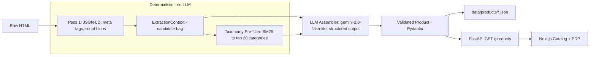

# Product Data Extraction Pipeline

Extracts structured product data from arbitrary HTML product pages (7-page corpus in this repo) with no site-specific logic, using a multi-pass pipeline that separates deterministic parsing from LLM reasoning.

## Quick Start

**Prerequisites:** Python 3.12+ with [uv](https://docs.astral.sh/uv/), Node.js 20+

### Backend

```bash
cp .env.example .env          # add your OPEN_ROUTER_API_KEY
uv sync
uv run python seed.py         # extract products from HTML (~30s, needs API key)
make backend
```

### Frontend

```bash
cd frontend
npm install
make frontend                   # http://localhost:3000
```

## How It Works



The pipeline is split into passes by design. Pass 1 does all the deterministic work — parsing JSON-LD, Open Graph meta tags, and embedded script blobs like `window.__INITIAL_STATE__` — and produces an `ExtractionContext`: a bag of *candidates* (multiple titles, prices, images) with nothing resolved yet. This is cheap, fast, and testable without an API key.

The taxonomy pre-filter uses BM25 to narrow Google's 5,600-line product taxonomy to ~20 plausible categories. The LLM assembler then resolves all candidates into a single validated `Product` using structured output. If the category validator rejects the LLM's choice, it retries once with the error appended.

This separation means extraction passes can be changed or replaced independently, deterministic bugs are reproducible without LLM calls, and the LLM only does what it's actually good at: semantic disambiguation.

See [docs/architecture.md](docs/architecture.md) for component-level detail.

## System Design: Scaling to 50M Products

### Backend at scale

The current pipeline processes 7 sample pages concurrently with `asyncio.gather` and writes flat JSON files. The extraction architecture — deterministic Pass 1 feeding into a single cheap LLM call — scales linearly in cost: at ~$0.005 per product on `gemini-2.0-flash-lite`, 50M products costs roughly $250K in inference, which is viable for a batch job. The BM25 index is built once and cached; it adds negligible overhead regardless of corpus size.

What breaks is the infrastructure around it. Flat JSON files become untenable past ~10K products — you need a database (Postgres with JSONB, or a document store) for indexed queries, concurrent writes, and catalog-level operations like filtering and search. The single-process `asyncio.gather` approach needs to become a distributed task queue (Celery/RQ, or a managed service like Cloud Tasks) with rate limiting against upstream sites and the LLM provider. HTML fetching — which is out of scope here since we work from pre-fetched files — becomes the real bottleneck at scale: you need a crawler with politeness controls, retry logic, and deduplication to avoid re-processing pages that haven't changed. The taxonomy pre-filter is keyword-based and won't need to change, but the LLM prompt may need per-vertical tuning as product diversity increases — a shoe prompt and an electronics prompt have different failure modes.

### Agentic shopping API

The read-only `GET /products` and `GET /products/{id}` endpoints are a starting point, but agentic shopping apps need richer query surfaces. The first addition would be structured filtering — `GET /products?category=Shoes&price_max=200&brand=Nike` — backed by indexed fields in a real database. Beyond filtering, a semantic search endpoint (`POST /products/search` with a natural-language query) would let agents find products by intent ("comfortable running shoes under $150") rather than exact attribute match. This could use the same embedding infrastructure as a future taxonomy upgrade.

For developers building new shopping experiences, I'd provide: (1) a webhook/streaming endpoint that emits newly extracted products as they're processed, so downstream apps don't need to poll; (2) a comparison endpoint that returns a structured diff between products (price, features, availability) to power "compare these two" flows; and (3) an OpenAPI spec with typed SDKs so agent frameworks like LangChain or Vercel AI SDK can call the API as a tool with zero glue code.

## CI

GitHub Actions is configured to run the full test suite (`make test-all`) on every push and PR. Slow eval tests require `OPEN_ROUTER_API_KEY` to be configured in repository secrets.

## Key Decisions

| Decision | Reasoning |
|----------|-----------|
| **BM25 over scikit-learn TF-IDF** | `rank-bm25` is a single focused dependency. scikit-learn pulls in numpy + scipy for one function. Hand-rolling BM25 means maintaining non-trivial math. |
| **Candidate bag pattern** | `ExtractionContext` holds lists of candidates, not resolved values. Loose typing is deliberate — strict typing before the LLM resolves ambiguity would invert the dependency. |
| **Single retry on validation error** | One retry covers the common case (category string mismatch). A loop would mask systematic prompt problems that need fixing, not more attempts. |
| **gemini-2.0-flash-lite** | ~$0.005/call. Quality is sufficient for structured assembly. Escalation path is flash-full, not a pipeline rewrite. |
| **No site-specific logic** | Zero conditionals on domain, XPath selectors, or page-specific prompt hints. The pipeline must generalize to unseen sites. |
| **Flat JSON files for storage** | Correct at this scale (7 products). The trade-off inverts at ~10K products — acknowledged, not over-engineered. |

See [docs/decisions.md](docs/decisions.md) for detailed trade-offs and bugs encountered during development.

## Project Structure

```
├── seed.py                      # Run extraction pipeline, write product JSON
├── models.py                    # Product, ExtractionContext, Category, Price, Variant
├── ai.py                        # OpenRouter API wrapper with cost logging
├── backend/
│   ├── extract/                 # Pass 1: JSON-LD, meta tags, script blob parsing
│   ├── taxonomy/                # BM25 category pre-filter
│   ├── assemble/                # LLM assembler (candidates → Product)
│   └── api/                     # FastAPI read-only routes
├── frontend/                    # Next.js 16 + React 19 + shadcn/ui
│   ├── app/                     # Catalog page (/) and PDP (/products/[id])
│   ├── components/              # ProductCard, ImageGallery, PriceDisplay
│   └── types/                   # TypeScript interfaces mirroring Pydantic models
├── data/
│   ├── *.html                   # 7 raw product pages (Ace, L.L.Bean, Nike, Article, etc)
│   └── products/                # Extracted product JSON (pre-seeded)
├── tests/                       # Unit tests + eval suite
└── docs/                        # Architecture deep dive + decision log
```

## Current Limits and Next Platform Steps

These were intentional scope boundaries for the take-home. They are the first areas to harden for production-scale systems.

- **Canonical commerce model**: current schema is `Product + Price + Variant`; next step is splitting into `Product` (identity), `Merchant`, and `Offer` (merchant-specific price/availability/shipping/promo) so the same product can have multiple offers without schema churn.
- **Entity resolution / identity**: dedupe now uses a two-tier strategy — UPC/GTIN exact match first, then title+brand similarity fallback when GTIN is absent. `CanonicalProductId` and explainable `MatchEvidence` are stored per product, with thresholds configurable via env vars.
- **Query surface**: current API is read-only listing/detail. Add deterministic filters first (`category`, `brand`, `price`, variant attributes), then semantic retrieval as rank-after-filter, not model-only retrieval.
- **Reliability and reprocessing**: seed script is batch-only. Move to idempotent jobs keyed by content hash, process only changed pages, and support backfills/reindex without downtime.
- **Explainability**: add field-level provenance (`value`, `source`, `confidence`) to extraction outputs so we can answer "why this value/category/match?" in logs and internal tooling.
